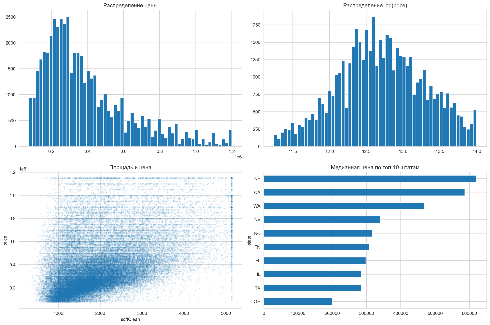
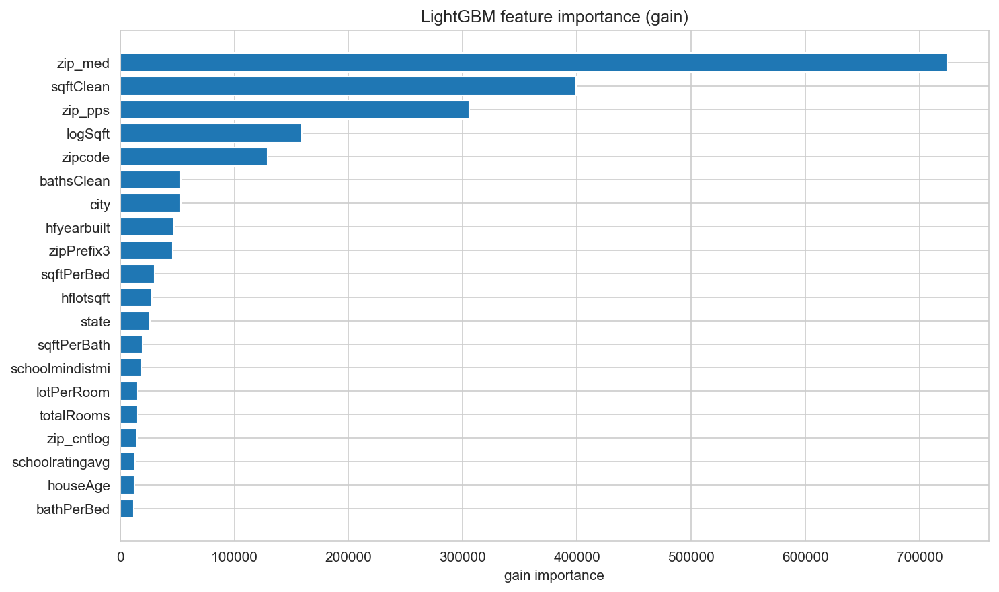
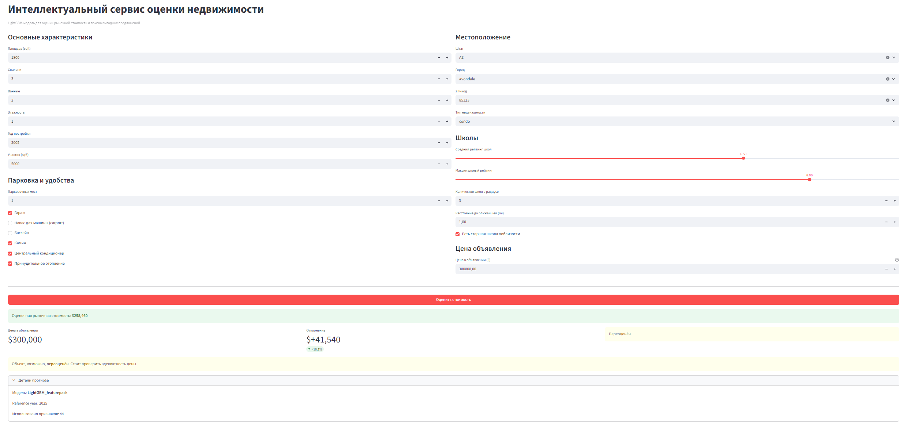

# Real Estate Valuation App

[](LICENSE)
[](https://www.python.org/downloads/)

**Интеллектуальный сервис оценки рыночной стоимости недвижимости**

Проект решает задачу предсказания цены объекта на основе его характеристик, географического положения и данных об инфраструктуре. Включает полный цикл: от обработки «сырых» данных до готового веб-приложения на Streamlit.


## Постановка задачи
К нам обратился представитель крупного агентства недвижимости со следующей проблемой:

*«Мои риелторы тратят катастрофически много времени на сортировку объявлений и поиск
выгодных предложений. Поэтому их скорость реакции, да и, сказать по правде, качество
анализа не дотягивают до уровня конкурентов. Это сказывается на наших финансовых
показателях»*

**Цель проекта** - построить модель, предсказывающую рыночную стоимость недвижимости по характеристикам объекта, данным объявления и дополнительным признакам, извлечённым из вложенных полей homeFacts и schools

**Практический смысл для заказчика:**
- быстрее фильтровать объявления
- сравнивать цену объявления с оценкой модели
- находить потенциально недооценённые объекты


## Что внутри

- **`dz_bLite_final_handcrafted_App2.ipynb`** – основной ноутбук с исследованием, feature engineering, обучением и сравнением моделей.
- **`app.py`** – веб-интерфейс на Streamlit для демонстрации работы модели.
- **`requirements.txt`** – зависимости проекта.
- **`data/real_estate_sample.csv`** – 1% семпл данных для быстрого тестирования.
- **`images`** – графики и скриншоты.


<p align="center">
  
</p>

Проект охватывает полный прикладной цикл:
- подготовку и очистку данных;
- обработку полуструктурированных полей;
- исследовательский анализ;
- генерацию признаков;
- сравнение нескольких моделей;
- обучение финальной модели;
- упаковку решения для инференса;
- разработку веб-приложения на Streamlit.

Итоговое решение позволяет не только оценивать рыночную стоимость объекта, но и сравнивать её с ценой из объявления, чтобы выявлять потенциально переоценённые или недооценённые предложения.

## Цель проекта

Цель проекта — разработать инструмент, который помогает:
- предсказывать рыночную стоимость недвижимости;
- использовать модель в прикладном сценарии;
- ускорять первичную оценку объектов;
- поддерживать принятие решений при анализе объявлений.

## Постановка задачи

На вход модели подаются характеристики объекта недвижимости, включая:
- площадь;
- количество спален и ванных комнат;
- этажность;
- тип недвижимости;
- год постройки;
- площадь участка;
- парковочные признаки;
- инфраструктурные и бытовые характеристики;
- географические признаки;
- характеристики школьного окружения.

На выходе модель формирует оценку рыночной стоимости объекта. Если дополнительно указана цена из объявления, приложение показывает отклонение от прогноза и помогает интерпретировать, насколько цена выглядит завышенной или заниженной.

## Что сделано в проекте

В ходе работы были выполнены следующие этапы:

1. Загрузка и первичный обзор исходного датасета.
2. Очистка и нормализация признаков.
3. Распаковка и обработка вложенных полей homeFacts и schools
4. Формирование базового набора признаков.
5. Разведочный анализ данных.
6. Проверка информативности части признаков статистическими методами.
7. Построение baseline-моделей.
8. Сравнение нескольких алгоритмов машинного обучения в одинаковых условиях.
9. Усиление модели за счёт feature engineering.
10. Обучение финальной модели.
11. Сохранение bundle для повторного использования.
12. Разработка Streamlit-приложения для демонстрации результата.

## Особенности решения

В проекте особое внимание уделено не только качеству итоговой модели, но и прикладной стороне решения.

Ключевые особенности:
- работа с неидеальными и частично полуструктурированными данными;
- преобразование сложных полей в устойчивое табличное представление;
- использование производных признаков и missing-флагов;
- добавление географических признаков;
- сравнение моделей в единой схеме валидации;
- подготовка production-ready bundle для инференса.

## Модели и подход

В проекте были рассмотрены:
- baseline-подходы;
- линейные модели;
- CatBoost;
- LightGBM.

<p align="center">
  
</p>

Финальная версия решения основана на LightGBM, поскольку эта модель показала наилучшее качество среди протестированных подходов и была выбрана в качестве основной для практического использования.

## Технологии

Проект реализован с использованием следующего стека:
- Python
- Pandas
- NumPy
- Scikit-learn
- SciPy
- LightGBM
- CatBoost
- Matplotlib
- Seaborn
- Streamlit


<p align="center">
  
</p>


## Быстрый старт

1. **Клонируйте репозиторий**
   ```bash
   git clone https://github.com/kuchsk/skillfactory_realestate.git
   cd real-estate-valuation

## Контакты
kuchsk      @ gmail.com
